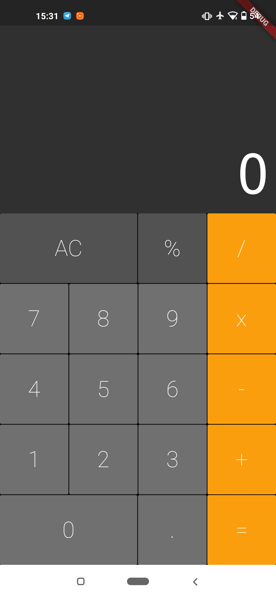

# Calculator

Calculator application. Do some simple calculations.

## Screen

<p align="center">
   
</p>

| Dependencies           | Description                                                  |
| ---------------------- | ------------------------------------------------------------ |
| auto_size_text: ^2.1.0 | The library automatically scales the texts on the screen preventing it from being overflow |
| flutter_icons          | add an icon to the app                                       |

---

## ⚠️ Requirements

You must have installed Flutter and Dart on your machine. For this, see the installation guide at: https://flutter.dev/docs/get-started/install


<h2 align="center"> How To Use 🤔</h2>

   ```
   
   - Clone this repository:
   $ git clone https://github.com/firminoazevedo/calculator

   - enter the directory:
   $ cd calculator

   - To install the dependencies:
   $ flutter pub get

   - Run the app: 
   $ flutter run
   ```

---

<h2 align="center">Como Contribuir 💪</h2>

   ```
   - Fork o projeto 

   - Cria uma nova branch com suas mudanças:
   $ git checkout -b my-feature

   - Salve suas mudanças e crie uma mensagem de commit falando o que fez:
   $ git commit -m "feature: My new feature"

   - Envie suas mudanças:
   $ git push origin my-feature
   ```


---


Feito com :heart: por [Firmino Neto](https://github.com/firminoazevedo) 🚀